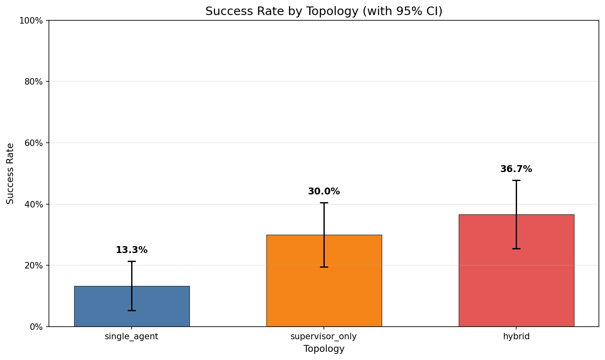
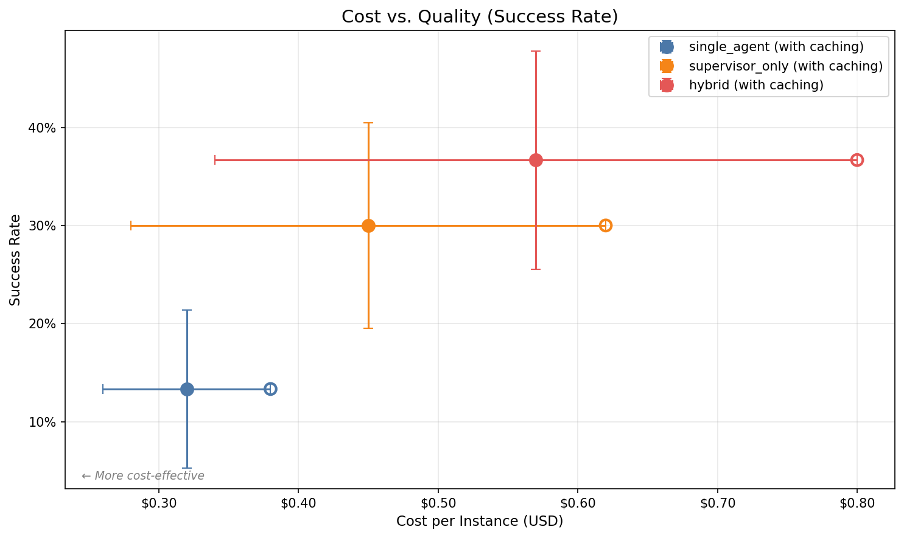
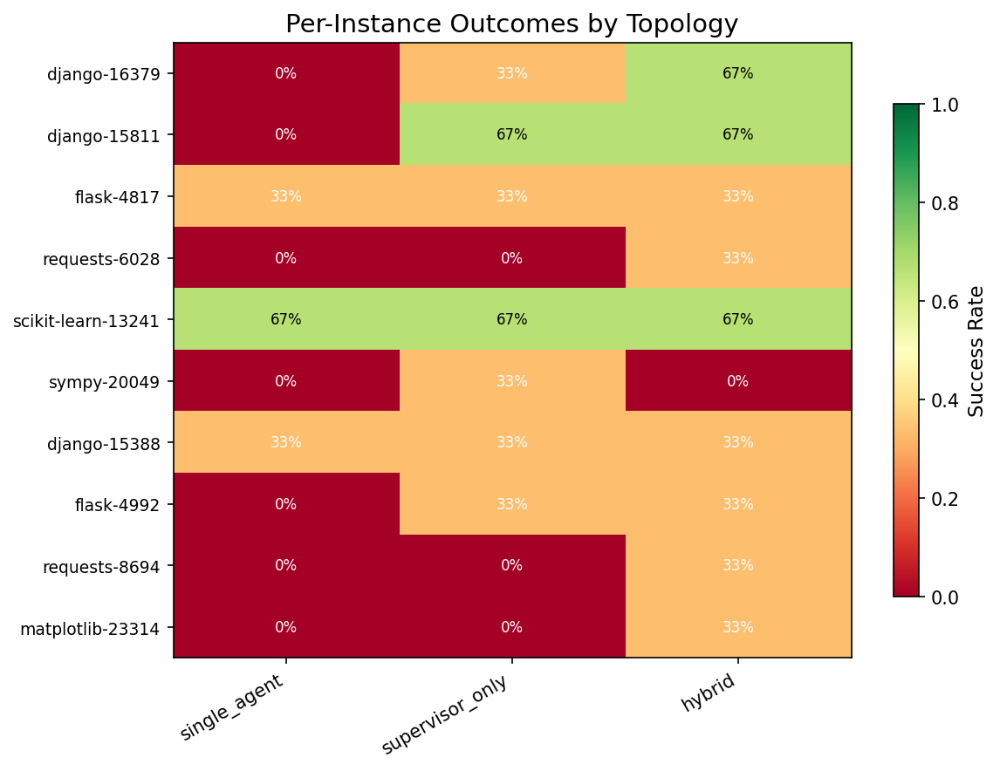

# SDLC-Swarm Benchmark Results

> **Note:** `results/m6-full-matrix-001.json` is a synthetic sample dataset that demonstrates the harness
> output format and the analysis/charting pipeline. It is not a real benchmark run.

## Run Metadata

- **Run ID:** `m6-full-matrix-001`
- **Started:** 2026-05-24T08:00:00Z
- **Ended:** 2026-05-24T20:00:00Z
- **Slice size:** 10 instances
- **Runs per cell:** 3

## Results Summary

Success rate, cost, latency, retries, and HITL escalations per topology.

| topology | success rate | 95% CI | avg cost (USD) | avg latency (s) | avg retries | HITL escalations |
| --- | --- | --- | --- | --- | --- | --- |
| single_agent | 13.3% | [5.3%, 21.4%] | $0.3200 | 32.5s | 0.20 | retry_budget_exhausted: 2, cost_budget_exhausted: 1 |
| supervisor_only | 30.0% | [19.5%, 40.5%] | $0.4500 | 55.3s | 0.50 | uncertainty_escalation: 2, loop_detected: 1, retry_budget_exhausted: 1 |
| hybrid | 36.7% | [25.5%, 47.8%] | $0.5700 | 68.7s | 0.40 | loop_detected: 2, uncertainty_escalation: 1 |

## Charts

### Success Rate by Topology

### Cost vs. Quality

### Per-Instance Outcomes Heatmap

## Cost Comparison: Caching ON vs OFF

Prompt caching reduces cost by reusing cached token blocks for Coder/Reviewer repo-context. The table below shows the average per-instance cost with and without caching, and the savings.

| topology | cost w/o caching (USD) | cost w/ caching (USD) | savings (USD) | savings % |
| --- | --- | --- | --- | --- |
| single_agent | $0.3800 | $0.3200 | $0.0600 | 15.8% |
| supervisor_only | $0.6200 | $0.4500 | $0.1700 | 27.4% |
| hybrid | $0.8000 | $0.5700 | $0.2300 | 28.8% |

## HITL Escalation Summary

Cause-tagged HITL escalation counts per topology. Escalations are triggered deterministically per §2.9.

| topology | escalation cause | count |
| --- | --- | --- |
| single_agent | retry_budget_exhausted | 2 |
| single_agent | cost_budget_exhausted | 1 |
| supervisor_only | uncertainty_escalation | 2 |
| supervisor_only | loop_detected | 1 |
| supervisor_only | retry_budget_exhausted | 1 |
| hybrid | loop_detected | 2 |
| hybrid | uncertainty_escalation | 1 |

## Per-Instance Details

| instance_id | topology | success rate | cost w/ caching | cost w/o caching | latency (s) | retries | HITL |
| --- | --- | --- | --- | --- | --- | --- | --- |
| django__django-16379 | single_agent | 0.0% | $0.2800 | $0.3200 | 28.3s | 0.00 | — |
| django__django-15811 | single_agent | 0.0% | $0.3400 | $0.4000 | 35.2s | 0.33 | retry_budget_exhausted |
| flask__flask-4817 | single_agent | 33.3% | $0.3000 | $0.3600 | 30.0s | 0.00 | — |
| requests__requests-6028 | single_agent | 0.0% | $0.3500 | $0.4200 | 38.1s | 0.67 | cost_budget_exhausted |
| scikit-learn__scikit-learn-13241 | single_agent | 66.7% | $0.3000 | $0.3500 | 29.5s | 0.00 | — |
| sympy__sympy-20049 | single_agent | 0.0% | $0.3700 | $0.4400 | 40.0s | 0.33 | — |
| django__django-15388 | single_agent | 33.3% | $0.3200 | $0.3800 | 33.0s | 0.00 | — |
| flask__flask-4992 | single_agent | 0.0% | $0.3000 | $0.3600 | 31.2s | 0.00 | — |
| requests__requests-8694 | single_agent | 0.0% | $0.3400 | $0.4000 | 34.5s | 0.33 | retry_budget_exhausted |
| matplotlib__matplotlib-23314 | single_agent | 0.0% | $0.3500 | $0.4200 | 36.0s | 0.00 | — |
| django__django-16379 | supervisor_only | 33.3% | $0.4200 | $0.5800 | 50.0s | 0.33 | — |
| django__django-15811 | supervisor_only | 66.7% | $0.4900 | $0.6800 | 60.5s | 0.33 | — |
| flask__flask-4817 | supervisor_only | 33.3% | $0.4300 | $0.6000 | 52.0s | 0.67 | loop_detected |
| requests__requests-6028 | supervisor_only | 0.0% | $0.4700 | $0.6500 | 58.0s | 1.00 | uncertainty_escalation |
| scikit-learn__scikit-learn-13241 | supervisor_only | 66.7% | $0.4000 | $0.5500 | 48.0s | 0.00 | — |
| sympy__sympy-20049 | supervisor_only | 33.3% | $0.5200 | $0.7200 | 65.0s | 0.67 | uncertainty_escalation |
| django__django-15388 | supervisor_only | 33.3% | $0.4500 | $0.6200 | 55.0s | 0.33 | — |
| flask__flask-4992 | supervisor_only | 33.3% | $0.4200 | $0.5800 | 51.0s | 0.00 | — |
| requests__requests-8694 | supervisor_only | 0.0% | $0.4300 | $0.6000 | 53.5s | 0.67 | retry_budget_exhausted |
| matplotlib__matplotlib-23314 | supervisor_only | 0.0% | $0.4200 | $0.5800 | 50.5s | 0.33 | — |
| django__django-16379 | hybrid | 66.7% | $0.5300 | $0.7500 | 62.0s | 0.00 | — |
| django__django-15811 | hybrid | 66.7% | $0.6000 | $0.8500 | 72.5s | 0.33 | — |
| flask__flask-4817 | hybrid | 33.3% | $0.5800 | $0.8200 | 70.0s | 0.67 | loop_detected |
| requests__requests-6028 | hybrid | 33.3% | $0.6200 | $0.8800 | 75.0s | 0.67 | loop_detected |
| scikit-learn__scikit-learn-13241 | hybrid | 66.7% | $0.5500 | $0.7800 | 65.0s | 0.00 | — |
| sympy__sympy-20049 | hybrid | 0.0% | $0.6400 | $0.9000 | 78.0s | 0.67 | uncertainty_escalation |
| django__django-15388 | hybrid | 33.3% | $0.5700 | $0.8000 | 68.5s | 0.33 | — |
| flask__flask-4992 | hybrid | 33.3% | $0.5300 | $0.7500 | 63.0s | 0.00 | — |
| requests__requests-8694 | hybrid | 33.3% | $0.5800 | $0.8200 | 70.5s | 0.33 | — |
| matplotlib__matplotlib-23314 | hybrid | 33.3% | $0.5100 | $0.7200 | 60.0s | 0.00 | — |
